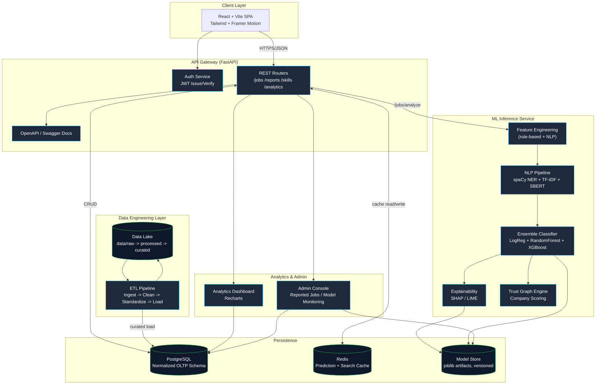
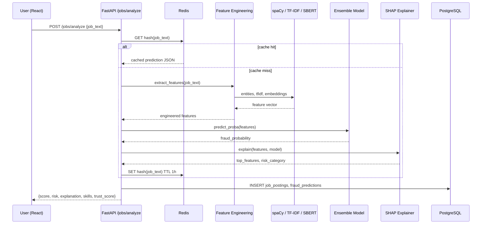

# SecureHire AI — System Architecture

```mermaid
flowchart TB
    subgraph Client["Client Layer"]
        WEB["React + Vite SPA<br/>Tailwind + Framer Motion"]
    end

    subgraph Gateway["API Gateway (FastAPI)"]
        AUTH["Auth Service<br/>JWT Issue/Verify"]
        REST["REST Routers<br/>/jobs /reports /skills /analytics"]
        DOCS["OpenAPI / Swagger Docs"]
    end

    subgraph ML["ML Inference Service"]
        FE["Feature Engineering<br/>(rule-based + NLP)"]
        NLP["NLP Pipeline<br/>spaCy NER + TF-IDF + SBERT"]
        MODEL["Ensemble Classifier<br/>LogReg + RandomForest + XGBoost"]
        XAI["Explainability<br/>SHAP / LIME"]
        TRUST["Trust Graph Engine<br/>Company Scoring"]
    end

    subgraph Data["Data Engineering Layer"]
        LAKE[("Data Lake<br/>data/raw -> processed -> curated")]
        ETL["ETL Pipeline<br/>Ingest -> Clean -> Standardize -> Load"]
    end

    subgraph Storage["Persistence"]
        PG[("PostgreSQL<br/>Normalized OLTP Schema")]
        REDIS[("Redis<br/>Prediction + Search Cache")]
        STORE[("Model Store<br/>joblib artifacts, versioned")]
    end

    subgraph Analytics["Analytics & Admin"]
        DASH["Analytics Dashboard<br/>Recharts"]
        ADMIN["Admin Console<br/>Reported Jobs / Model Monitoring"]
    end

    WEB -->|HTTPS/JSON| REST
    WEB --> AUTH
    REST --> DOCS

    REST -->|/jobs/analyze| FE
    FE --> NLP
    NLP --> MODEL
    MODEL --> XAI
    MODEL --> TRUST
    XAI --> STORE
    MODEL --> STORE

    REST <-->|cache read/write| REDIS
    REST <-->|CRUD| PG

    ETL --> LAKE
    LAKE --> ETL
    ETL -->|curated load| PG

    REST --> DASH
    REST --> ADMIN
    DASH --> PG
    ADMIN --> PG
    ADMIN --> STORE

    classDef svc fill:#1e293b,stroke:#38bdf8,color:#fff
    classDef data fill:#0f172a,stroke:#22c55e,color:#fff
    class AUTH,REST,DOCS,FE,NLP,MODEL,XAI,TRUST,ETL,DASH,ADMIN svc
    class PG,REDIS,STORE,LAKE data
```

## Request Flow: "Analyze Job" (core feature)

```mermaid
sequenceDiagram
    participant U as User (React)
    participant API as FastAPI /jobs/analyze
    participant Cache as Redis
    participant FEAT as Feature Engineering
    participant NLP as spaCy / TF-IDF / SBERT
    participant MDL as Ensemble Model
    participant XAI as SHAP Explainer
    participant DB as PostgreSQL

    U->>API: POST /jobs/analyze {job_text}
    API->>Cache: GET hash(job_text)
    alt cache hit
        Cache-->>API: cached prediction JSON
    else cache miss
        API->>FEAT: extract_features(job_text)
        FEAT->>NLP: entities, tfidf, embeddings
        NLP-->>FEAT: feature vector
        FEAT-->>API: engineered features
        API->>MDL: predict_proba(features)
        MDL-->>API: fraud_probability
        API->>XAI: explain(features, model)
        XAI-->>API: top_features, risk_category
        API->>Cache: SET hash(job_text) TTL 1h
    end
    API->>DB: INSERT job_postings, fraud_predictions
    API-->>U: {score, risk, explanation, skills, trust_score}
```
